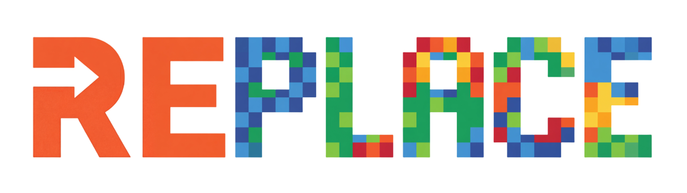
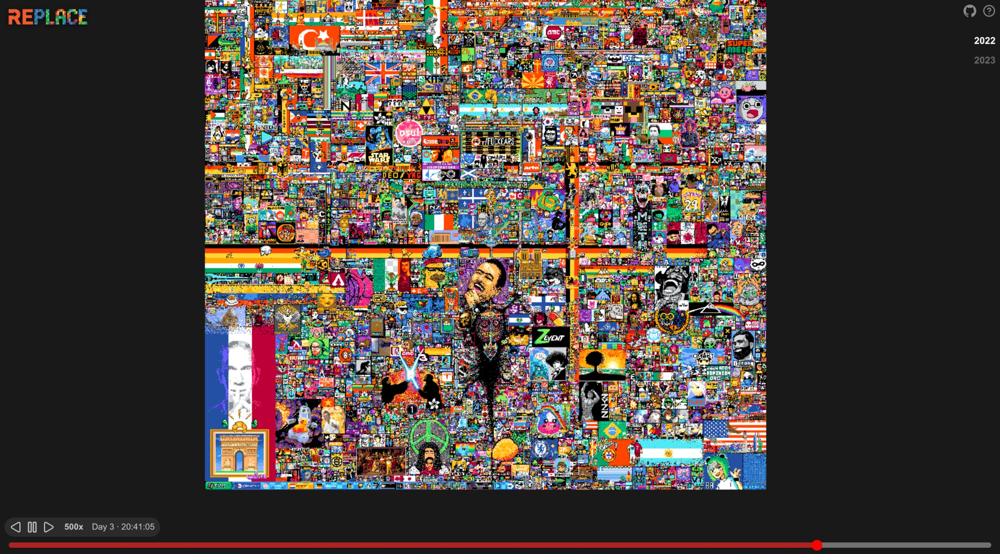

  

# Re/place

A local viewer for r/place that lets you scroll through the entire history and see pixel changes in realtime. Supports both r/place 2022 (2000x2000) and 2023 (3000x2000) datasets.

## Features

- WebGL-rendered canvas with pan, zoom, and pinch-to-zoom support
- Smooth inertia panning on mouse and touch
- Playback controls with forward/backward at variable speeds (1x–1000x)
- Seekbar with drag scrubbing and hover timestamp tooltips
- YouTube-style keyboard shortcuts (j/k/l, 0-9 for position jumps)
- Checkpoint prefetching and caching for smooth playback
- Adaptive checkpoint intervals for efficient seeking

## Data pipeline

The raw r/place CSVs (gzipped) are preprocessed into a format optimized for browser playback. The raw data is unsorted both within files and across files (file numbering is arbitrary, not chronological). A two-phase external sort handles this:

1. **Sort phase**: Each gzip file is decompressed, parsed, sorted by timestamp, and written to a sorted intermediate file.
2. **Merge phase**: All sorted intermediates are k-way merged (via a min-heap) to produce a single globally-sorted stream of pixel placements.

### Checkpoints

Raw binary snapshots of the full canvas at adaptive intervals. Each checkpoint is a flat file of palette indices (1 byte per pixel). A new checkpoint is created when either 3 minutes have elapsed or 200,000 pixel updates have accumulated since the last checkpoint, whichever comes first. All timestamps are normalized relative to the first placement (time 0). Used as keyframes for seeking — the browser loads the nearest checkpoint and replays deltas forward.

> **Why `.bin` instead of PNG?** Indexed PNGs seemed like a natural fit since the data is palette-indexed, but PNG decoding in the browser (even with JS libraries like upng-js) takes 50-200ms per checkpoint depending on hardware. That's too slow for smooth seeking. Raw `.bin` files require zero decode time — just fetch and upload directly to a WebGL R8 texture. HTTP-level gzip compression provides similar transfer sizes to PNG without any client-side cost.

### Deltas

Binary files containing individual pixel changes between checkpoints. Each pixel change is packed into 9 bytes:

| Field            | Size    | Type                         |
|------------------|---------|------------------------------|
| timestamp offset | 4 bytes | uint32 (ms from chunk start) |
| x                | 2 bytes | uint16                       |
| y                | 2 bytes | uint16                       |
| color index      | 1 byte  | uint8                        |

Delta files are pre-sorted by timestamp. The timestamp offset is relative to the chunk's start time. Delta files are named alongside their checkpoint (e.g., `000001.bin` and `000001-delta.bin`).

### Manifest

A JSON file listing all checkpoints with their timestamps, color palette, canvas dimensions, and total event length. Required because checkpoint intervals are adaptive — the browser uses the manifest to find the nearest checkpoint when seeking.

## Tasks

### Preprocessing (Rust)
- [x] Sort raw CSV data (external merge sort: sort each file, then k-way merge)
- [x] Parse CSV rows from gzip files
- [x] Map hex colors to palette indices
- [x] Build in-memory canvas state
- [x] Generate checkpoint .bin files at adaptive intervals
- [x] Pack deltas into binary files between checkpoints
- [x] Write manifest JSON
- [x] r/place 2022 parsing support
- [x] r/place 2023 parsing support
- [x] Parse moderation records

### Viewer (Web)
- [x] Load manifest and set up data fetching
- [x] WebGL rendering with indexed palette textures
- [x] Delta playback engine
- [x] Playback controls (play/pause/reverse, variable speed)
- [x] Seek to any point (load nearest checkpoint + replay deltas)
- [x] Seekbar with drag scrubbing and hover tooltips
- [x] Keyboard shortcuts (j/k/l, f, 0-9, arrow keys, +/-)
- [x] Mouse and touch pan/zoom with inertia
- [x] Checkpoint caching
- [x] Loading state indicators
- [x] Prefetch checkpoints ahead of playback position
- [ ] YouTube-style seekbar drag-up-to-zoom

## Special Thanks

- [Woutervdvelde/AmongiAnalyser](https://github.com/Woutervdvelde/AmongiAnalyser) — amongi detection algorithm
